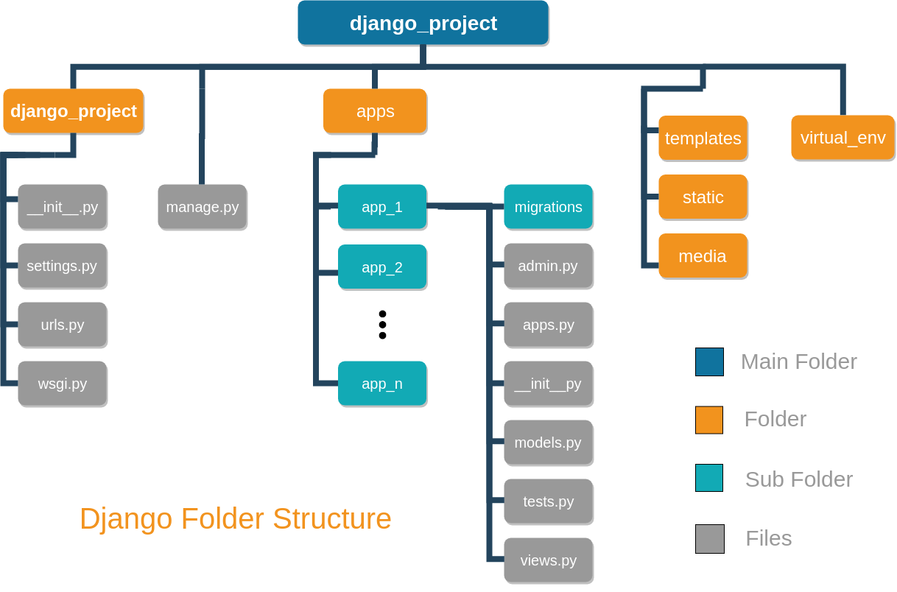

# Django

Características

- Open Source
- Rápido
- Seguro
- Escalable

## Seguridad en Django

Protección contra la falsificación de solicitudes en sitios cruzados (CSRF):

- Los ataques CSRF permiten que un usuario malintencionado ejecute acciones utilizando las credenciales de otro usuario sin el conocimiento de este. 👿
- Django tiene protección incorporada contra la mayoría de los tipos de ataques CSRF. 😎

Protección de inyección SQL:

- La inyección SQL es un tipo de ataque en el que un usuario malicioso es capaz de ejecutar código SQL arbitrario en una base de datos. 💉
- Los conjuntos de consultas de Django están protegidos de la inyección de SQL ya que sus consultas se construyen utilizando la parametrización de consultas.

Protección contra el clickjacking:

- El clickjacking es un tipo de ataque en el que un sitio malicioso envuelve a otro sitio en un marco. Este ataque puede hacer que un usuario desprevenido sea engañado para que realice acciones no deseadas en el sitio objetivo.

Protección contra clics en forma de X-Frame-Options middleware que en un navegador compatible puede evitar que un sitio se represente dentro de un marco.

Protección de la escritura de sitios cruzados (XSS):

Los ataques XSS permiten a un usuario inyectar scripts del lado del cliente en los navegadores de otros usuarios. 💉

El uso de plantillas Django te protege contra la mayoría de los ataques XSS.

## [Instalacion Django](Instalcion.md)

---

# Estructura de un proyecto Django



Archivos y su función:

- `manage.py`: Es el punto de entrada para la administración de un proyecto Django. Con él puedes interactuar con el proyecto de varias formas.
- `settings.py`: Contiene la configuración del proyecto Django.
- `urls.py`: Contiene las definiciones de URL del proyecto Django.
- `wsgi.py`: Es el punto de entrada para servir el proyecto en producción con un servidor web compatible con WSGI.
- `asgi.py`: Es el punto de entrada para servir el proyecto en producción con un servidor web compatible con ASGI.
- `__init__.py`: Es un archivo vacío que indica a Python que este directorio debe tratarse como un paquete Python.

# Servidor de desarrollo

Para iniciar el servidor de desarrollo, ejecuta el siguiente comando:

```bash
python manage.py runserver
```

El servidor de desarrollo se ejecuta en el puerto 8000 por defecto.

# Como trabajamos en Django

En Django, podemos trabajar con dos objetos principales:

- Proyectos: Es una colección de configuraciones y aplicaciones para un sitio web particular. Un proyecto puede contener múltiples aplicaciones. Un proyecto puede ser considerado como una instancia de Django.
- Aplicaciones: Es una aplicación web que realiza una tarea específica. Puede ser una aplicación de blog, una aplicación de encuestas o cualquier otra cosa. Puede contener una variedad de archivos que definen su comportamiento.

